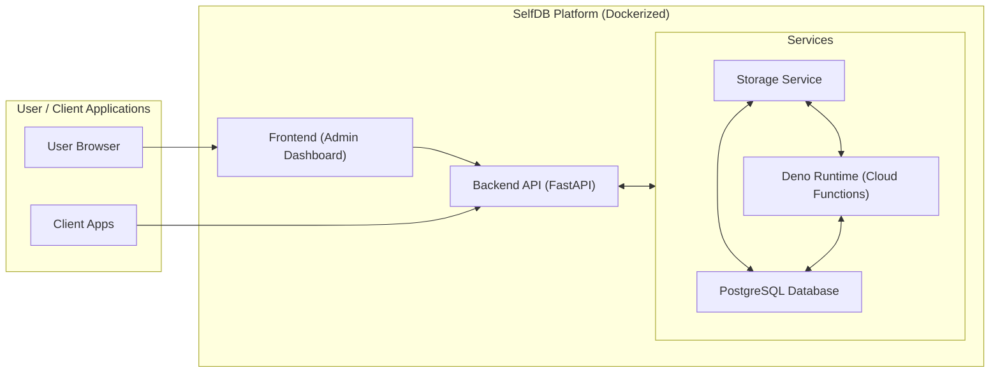

# SelfDB

SelfDB is a self-hosted, open-source alternative to Supabase, providing PostgreSQL database, authentication, object storage, real-time capabilities, and cloud functions in a single, containerized platform.

## Features

- **PostgreSQL Database**: Powerful, reliable database for your application data
- **Authentication**: Secure user authentication with JWT tokens and anonymous access capabilities
- **Object Storage**: Integrated file storage using the SelfDB Storage Service
- **Real-time Updates**: WebSocket-based real-time data synchronization
- **Cloud Functions**: Serverless functions using Deno 2.0 for custom business logic
- **Containerized**: Easy deployment with Docker and Docker Compose
- **Production-Ready**: Includes security, logging, and monitoring considerations
- **Dual License**: Available under both Commercial and MIT (Community Edition) licenses

## Prerequisites

- Docker and Docker Compose
- Git (for cloning the repository)
- SSL certificate and domain for production deployments

## Quick Start

1. Buy from selfdb.io
   - Download zip repo and open it

2. Create a `.env` file from the example:
   ```bash
   cp .env.example .env
   ```

3. Edit the `.env` file to set secure passwords and configuration.

4. Start the application using the provided script (which sets up Docker volumes for data persistence):
   ```bash
   ./start.sh
   ```

   **Note:** The application uses Docker named volumes for data persistence. These volumes are managed by Docker and will persist even when containers are removed.

   Alternatively, you can start the services directly with Docker Compose:
   ```bash
   docker-compose up -d
   ```

5. The database will be automatically initialized on first startup with:
   - Database tables created via migrations
   - Default superuser created with the credentials specified in your `.env` file:
     - Email: `DEFAULT_ADMIN_EMAIL` (default: `admin@example.com`)
     - Password: `DEFAULT_ADMIN_PASSWORD` (default: `adminpassword`)
   - Anonymous API key (`ANON_KEY`) generated for public access to resources

   **Important:** Change these credentials in your `.env` file for production use!

   If you need to manually run the initialization later:
   ```bash
   docker-compose exec backend python -m app.initial_data
   ```

6. Access the application:
   - Frontend: http://localhost:3000
   - API: http://localhost:8000
   - Storage Service: http://localhost:8001
   - Deno Runtime: http://localhost:8090 (internal service for cloud functions)

### PostgreSQL 18 volume layout changes

PostgreSQL 18 modifies the image defaults so `PGDATA` now resides in `/var/lib/postgresql/<major>/docker` and the image declares `/var/lib/postgresql` as the persistent volume mount (see [docker-library/postgres#1259](https://github.com/docker-library/postgres/pull/1259)). The included `docker-compose.yml` already reflects this layout, but if you are upgrading an existing volume from PostgreSQL 17 you should:

1. **Back up your data** – either by creating a logical dump (`pg_dumpall`) or snapshotting the Docker volume.
2. Restructure the volume so that your old cluster lives in a versioned subdirectory. For example, when the volume is mounted locally it should resemble:

  ```text
  postgres_data/
    17/
     docker/    # existing PGDATA from v17
  ```

3. Run `pg_upgrade` (or the official [docker-postgres-upgrade](https://github.com/tianon/docker-postgres-upgrade) image) to create the new `18/docker` directory inside the same volume.
4. Update any bind mounts or off-box backups to include the new layout.

If you start fresh (no existing volume), Docker will create the correct structure automatically.

## Architecture

SelfDB consists of the following components:



-   **PostgreSQL**: Database for storing application data.
-   **Storage Service**: Integrated file storage service for buckets and files.
-   **Backend API**: FastAPI application providing REST endpoints and WebSocket connections.
-   **Frontend**: React application for user interface and admin dashboard.
-   **Deno Runtime**: Serverless function execution environment using Deno 2.0.

## Client SDKs

SelfDB provides official client SDKs for different platforms:

### Swift Package (iOS/macOS/tvOS/watchOS)

A native Swift package for Apple platforms with full async/await support:

```swift
// Swift Package Manager
dependencies: [
    .package(url: "https://github.com/rodgersmag/SelfDB.git", from: "1.0.0")
]

// Usage
import SelfDB

let config = SelfDBConfig(
    apiURL: "https://your-selfdb-api.com/api/v1",
    storageURL: "https://your-selfdb-storage.com",
    apiKey: "your-anon-key"
)

let selfDB = SelfDB(config: config)

// Authenticate
let response = await selfDB.auth.login(email: "user@example.com", password: "password")

// Database operations
let tables = await selfDB.database.listTables()

// Storage operations
let buckets = await selfDB.storage.listBuckets()
```

**Features:**
- Type-safe Swift Codable models
- Modern async/await patterns
- Multi-platform support (iOS 15+, macOS 12+, tvOS 15+, watchOS 8+)
- Authentication, Database, Storage, and future Realtime support
- Comprehensive test coverage

For detailed documentation, see [README-Swift.md](README-Swift.md).

### JavaScript/TypeScript SDK

Located in the `js-sdk/` directory with full TypeScript support and comprehensive documentation.

## Anonymous Access

SelfDB supports anonymous access to public resources using an API key. This allows unauthenticated clients to access designated public resources without requiring user login.

### How it works

1. A unique `ANON_KEY` is automatically generated during setup and stored in the `.env` file.
2. Clients include this key in the `apikey` HTTP header of their requests.
3. Endpoints check if the request is authenticated (JWT token), anonymous (valid `ANON_KEY`), or unauthorized.
4. Resources (like buckets and files) have an `is_public` flag that controls whether they can be accessed anonymously.

#### Backend Implementation

The SelfDB backend implements anonymous access through a dedicated authentication dependency:

- An `APIKeyHeader` scheme extracts the key from the `apikey` HTTP header
- The `get_current_user_or_anon` dependency function checks for both JWT tokens and the anon key
- When a valid anon key is provided, it returns a special `ANON_USER_ROLE` constant
- API endpoints can distinguish between authenticated users, anonymous users, and unauthorized requests
- This allows for fine-grained access control based on authentication status

### Using the Anonymous API Key

To access public resources without authentication:

```bash
# Example using curl
curl -H "apikey: YOUR_ANON_KEY" http://localhost:8000/api/v1/buckets/public
```

Where `YOUR_ANON_KEY` is the value generated in your `.env` file.

#### Client Implementation

In client applications, you typically want to use JWT tokens for authenticated users and fall back to the anon key for unauthenticated users. Here's an example using axios interceptors:

```typescript
// Get the API URL and anonymous key from environment variables
const API_URL = import.meta.env.VITE_API_URL || 'http://localhost:8000/api/v1';
const ANON_KEY = import.meta.env.VITE_ANON_KEY;

// Create a base axios instance for SelfDB API
const API = axios.create({
  baseURL: API_URL,
  headers: {
    'Content-Type': 'application/json',
  },
});

// Add authentication to all requests
API.interceptors.request.use(config => {
  // First check for a token (authenticated user)
  const token = localStorage.getItem('access_token');

  if (token && config.headers) {
    // Use Bearer token for authenticated requests
    config.headers.Authorization = `Bearer ${token}`;
  } else if (ANON_KEY && config.headers) {
    // Fall back to anonymous key for unauthenticated requests
    config.headers.apikey = ANON_KEY;
  }

  return config;
});
```

This pattern allows your application to seamlessly handle both authenticated and anonymous users.

### Security Considerations

- The `ANON_KEY` provides read and write access to public resources.
- Only mark resources as public if you intend them to be accessible without authentication.
- For production use, consider regenerating the `ANON_KEY` periodically.
- Anonymous users can typically:
  - Read data from public tables
  - Write data to public tables (with appropriate permissions)
  - List public buckets
  - Upload files to public buckets
  - View files from public buckets
- Anonymous users cannot typically:
  - Access private resources
  - Modify or delete resources created by authenticated users
  - Access administrative endpoints

### Sample Application

For a complete example of anonymous access implementation, see the `open-discussion-board` sample application in the `@sample-apps/` directory. This application demonstrates:

- Support for both authenticated and anonymous users
- Anonymous posting of topics and comments without requiring registration
- Media upload support for both anonymous and authenticated users
- Proper implementation of the anon key in API requests
- File uploads to public buckets using anonymous access

To run the sample app:

1. Navigate to the sample app directory: `cd sample-apps/open-discussion-board`
2. Install dependencies: `npm install`
3. Set up environment variables: `./setup.sh` (automatically copies the ANON_KEY from your SelfDB `.env` file)
4. Start the development server: `npm run dev`

The app will be available at `http://localhost:5173`.

**Note for Production Use:**
When deploying the sample app to production, modify the `.env` file to use your SSL-secured API URL:
```
VITE_API_URL=https://api.your-domain.com/api/v1
VITE_ANON_KEY=your_anon_key
```

## Development

### Rebuilding Containers

During development, you may need to rebuild your containers without losing your data. Use the provided rebuild script:

```bash
./rebuild.sh
```

This script will rebuild all containers while preserving your data stored in Docker volumes.

### Backend

The backend is built with FastAPI and provides:

- REST API endpoints for authentication, file management, etc.
- WebSocket connections for real-time updates
- Database models and migrations
- Integration with the Storage Service for object storage
- Cloud function management and deployment
- Code validation and linting services for the function editor

To run the backend in development mode:

```bash
cd backend
pip install -r requirements.txt
uvicorn app.main:app --reload
```

### Frontend

The frontend is built with React and provides:

- User interface for authentication, file management, etc.
- Integration with the backend API
- Real-time updates using WebSockets
- Cloud function management interface

To run the frontend in development mode:

```bash
cd frontend
npm install
npm start
```

### Cloud Functions

SelfDB includes a serverless function execution environment powered by Deno 2.0. This allows you to write and deploy custom business logic that runs in response to HTTP requests, scheduled events, or database changes.

Key features of the cloud functions system:

- **Deno 2.0 Runtime**: Modern JavaScript/TypeScript runtime with built-in security
- **Multiple Trigger Types**: Functions can be triggered by HTTP requests, scheduled events, or database changes
- **Environment Variables**: Securely store and access configuration and secrets
- **Version History**: Track changes to your functions with automatic versioning
- **Database Access**: Direct access to your PostgreSQL database from functions
- **Event-Driven Architecture**: Build reactive applications with real-time database triggers

Cloud functions are stored in the `./functions` directory and are automatically loaded by the Deno runtime container. The frontend provides a complete management interface for creating, editing, and deploying functions.

Example function:

```typescript
// Simple HTTP function
export default async function handler(req) {
  // Access environment variables
  const dbUrl = Deno.env.get("DATABASE_URL");

  // Process HTTP request
  if (req instanceof Request) {
    const url = new URL(req.url);
    const params = Object.fromEntries(url.searchParams.entries());

    return new Response(JSON.stringify({
      message: "Hello from SelfDB function!",
      method: req.method,
      params: params
    }), {
      headers: { "Content-Type": "application/json" }
    });
  }

  // For non-HTTP invocations (scheduled runs, etc.)
  console.log("Function executed at:", new Date().toISOString());
  return { success: true };
}
```

## Production Deployment

For production deployment, consider the following:

1. Use strong, unique passwords in the `.env` file
2. Set up a reverse proxy (like Nginx) with SSL/TLS
3. Configure proper backup strategies for the data directories
4. Set up monitoring and logging

### Production URL Configuration

When deploying to production, you must configure secure URLs with SSL for both the admin interface and API access:

1. **Frontend Admin URL**:
   - The frontend should be accessed through a secure domain with SSL
   - Update your reverse proxy (Nginx, etc.) to point to your SelfDB frontend container
   - Example Nginx configuration:
     ```nginx
     server {
         listen 443 ssl;
         server_name admin.yourdomain.com;

         # SSL configuration
         ssl_certificate /path/to/certificate.crt;
         ssl_certificate_key /path/to/private.key;

         location / {
             proxy_pass http://localhost:3000;
             proxy_set_header Host $host;
             proxy_set_header X-Real-IP $remote_addr;
         }

         # WebSocket Secure (WSS) support for frontend
         location /ws/ {
             proxy_pass http://localhost:3000;
             proxy_http_version 1.1;
             proxy_set_header Upgrade $http_upgrade;
             proxy_set_header Connection "upgrade";
             proxy_set_header Host $host;
             proxy_cache_bypass $http_upgrade;
         }
     }
     ```

2. **Backend API URL**:
   - The API should also be accessed through a secure domain with SSL
   - Update the same or a different reverse proxy to point to your SelfDB backend container
   - Example Nginx configuration:
     ```nginx
     server {
         listen 443 ssl;
         server_name api.yourdomain.com;

         # SSL configuration
         ssl_certificate /path/to/certificate.crt;
         ssl_certificate_key /path/to/private.key;

         location / {
             proxy_pass http://localhost:8000;
             proxy_set_header Host $host;
             proxy_set_header X-Real-IP $remote_addr;

             # WebSocket support for real-time features
             proxy_http_version 1.1;
             proxy_set_header Upgrade $http_upgrade;
             proxy_set_header Connection "upgrade";
         }

         # Dedicated location for realtime WebSocket connections
         location /realtime/ {
             proxy_pass http://localhost:8000;
             proxy_http_version 1.1;
             proxy_set_header Upgrade $http_upgrade;
             proxy_set_header Connection "upgrade";
             proxy_set_header Host $host;
             proxy_cache_bypass $http_upgrade;
         }

         # WebSocket Secure (WSS) support for websocket connections
         location /ws/ {
             proxy_pass http://localhost:8000;
             proxy_http_version 1.1;
             proxy_set_header Upgrade $http_upgrade;
             proxy_set_header Connection "upgrade";
             proxy_set_header Host $host;
             proxy_cache_bypass $http_upgrade;
         }
     }
     ```

3. **Sample Apps Configuration**:
   - For any sample or production apps built using SelfDB, update the API URL in their environment files:
   - Example `.env` file for a React/Vite app:
     ```
     VITE_API_URL=https://api.yourdomain.com/api/v1
     VITE_ANON_KEY=your_anon_key
     ```

**Summary of Production URL Configuration:**
- Admin UI access requires a secure domain (HTTPS) with SSL certificates
- API access requires a secure domain with proper WebSocket support
- All WebSocket connections must use WSS (WebSocket Secure) in production
- All sample apps must be configured with HTTPS URLs pointing to your secured API
- The configuration includes specific Nginx location blocks for different connection types:
  - Standard HTTP/HTTPS requests (`/`)
  - WebSocket connections for real-time features (`/ws/`)
  - Dedicated realtime connections (`/realtime/`)

**Important**: Always use HTTPS URLs in production to ensure security for your data and authentication tokens.

## Testing

SelfDB includes comprehensive test suites to verify functionality and ensure quality across all components.

### Test Structure

The project contains two main test suites:

#### 1. API Test Suite (`tests/` folder)
- **Purpose**: End-to-end testing of all SelfDB backend API endpoints
- **Framework**: Python with `requests` and `websockets` libraries
- **Coverage**: 84 test cases across 15 test suites
- **Features**: Real-time WebSocket testing, comprehensive reporting, cleanup automation

#### 2. Storage Service Test Suite (`storage_service/tests/` folder)
- **Purpose**: Unit and performance testing of the storage service
- **Framework**: pytest with async support
- **Coverage**: File operations, large file handling, performance benchmarks
- **Features**: Configurable test file sizes, performance metrics

### Running the API Test Suite

The main test suite tests all backend API endpoints and can be run against both local and production instances.

#### Prerequisites

Install required Python packages:
```bash
pip install requests websockets
```

#### Basic Usage

```bash
# Run all tests against default endpoints (api.selfdb.io)
cd tests
python run_all_tests.py
```

#### Testing Against Local Development Instance

To test against a local SelfDB instance:

```bash
# Set environment variables for local testing
export BACKEND_URL="http://localhost:8000/api/v1"
export STORAGE_URL="http://localhost:8001"
export API_KEY="your_anon_key_from_env_file"

# Run the tests
cd tests
python run_all_tests.py
```

#### Running Individual Test Modules

You can run individual test modules independently:

```bash
cd tests

# Test health endpoints
python test_01_health.py

# Test authentication
python test_02_auth.py

# Test file management
python test_05_files.py

# Test storage service
python test_10_storage.py
```

#### Test Configuration

The tests use configuration from `tests/common/config.py`:
- **BACKEND_URL**: Backend API endpoint (default: https://api.selfdb.io/api/v1)
- **STORAGE_URL**: Storage service endpoint (default: https://storage.selfdb.io)
- **API_KEY**: Anonymous API key for public resource access
- **TEST_EMAIL_BASE**: Base name for test user accounts
- **ADMIN_EMAIL**: Admin account for privileged operations

#### Test Output

Tests generate detailed reports including:
- Individual endpoint test results
- WebSocket real-time functionality verification
- Test statistics and success rates
- Failed test details with status codes and URLs
- Cleanup summary for created test resources

### Running the Storage Service Test Suite

The storage service tests focus on file operations and performance validation.

#### Prerequisites

```bash
cd storage_service
pip install pytest pytest-asyncio httpx aiofiles pydantic-settings fastapi python-multipart requests
```

#### Basic Usage

```bash
cd storage_service

# Run with default settings (10MB test files)
./run_tests.sh

# Run with specific file sizes
./run_tests.sh --size=small     # 10MB
./run_tests.sh --size=medium    # 50MB
./run_tests.sh --size=large     # 500MB
./run_tests.sh --size=extra_large # 1GB
./run_tests.sh --size=all       # All sizes (warning: takes long time)
```

#### Environment Setup

The storage tests automatically create a virtual environment and set up:
- Temporary storage directory: `/tmp/selfdb-test-storage`
- Test API key: `test-api-key`
- Required environment variables: `SECRET_KEY`, `ANON_KEY`
- Configurable test file sizes

#### Direct pytest Usage

You can also run pytest directly:

```bash
cd storage_service

# Set required environment variables
export STORAGE_SERVICE_API_KEY="test-api-key"
export STORAGE_BASE_PATH="/tmp/selfdb-test-storage"
export TEST_FILE_SIZE="small"
export SECRET_KEY="test-secret-key-for-storage-service-tests"
export ANON_KEY="test-anon-key"

# Install dependencies
pip install pytest pytest-asyncio fastapi uvicorn aiofiles

# Run tests
pytest tests/ -v
```

**Note**: If you encounter network timeouts during dependency installation, you can skip the storage service tests and focus on the main API tests instead.

### Test Suites Overview

#### API Test Modules

1. **test_01_health.py** - Health check endpoints
2. **test_02_auth.py** - User authentication and registration
3. **test_03_users.py** - User management operations
4. **test_04_buckets.py** - Bucket creation and management
5. **test_05_files.py** - File upload, download, and metadata
6. **test_06_tables.py** - Database table operations
7. **test_07_sql.py** - SQL query execution
8. **test_08_functions.py** - Cloud function management
9. **test_09_cors.py** - CORS configuration testing
10. **test_10_storage.py** - Storage service integration
11. **test_11_errors.py** - Error condition handling
12. **test_12_realtime.py** - WebSocket real-time features

#### Storage Service Test Modules

1. **test_requirements.py** - Core functionality validation
2. **test_large_file_operations.py** - Large file handling
3. **test_download_performance.py** - Performance benchmarks
4. **conftest.py** - pytest fixtures and setup
5. **test_env.py** - Environment configuration

### Prerequisites for Local Testing

To run tests against a local SelfDB instance:

1. **Start SelfDB services**:
   ```bash
   docker-compose up -d
   ```

2. **Wait for services to be ready** (usually 30-60 seconds)

3. **Set environment variables**:
   ```bash
   export BACKEND_URL="http://localhost:8000/api/v1"
   export STORAGE_URL="http://localhost:8001"
   export API_KEY="$(grep ANON_KEY .env | cut -d= -f2)"
   ```

4. **Run tests**:
   ```bash
   cd tests
   python run_all_tests.py
   ```

### Continuous Integration

For automated testing in CI/CD pipelines:

```bash
# Install dependencies
pip install requests websockets pytest pytest-asyncio httpx aiofiles

# Set environment for local testing
export BACKEND_URL="http://localhost:8000/api/v1"
export STORAGE_URL="http://localhost:8001"

# Start services
docker-compose up -d

# Wait for services
sleep 60

# Run API tests
cd tests && python run_all_tests.py

# Run storage tests
cd ../storage_service && ./run_tests.sh --size=small
```

### Test Data Management

The test suites automatically:
- Create temporary test users, buckets, and files
- Clean up created resources after test completion
- Use isolated environments to avoid conflicts
- Generate unique identifiers to prevent collisions

See [TEST_COVERAGE.md](TEST_COVERAGE.md) for detailed test coverage information.

## Backup and Restore

To backup your data:

1. Stop the containers:
   ```bash
   docker-compose down
   ```

2. Backup the Docker volumes:
   ```bash
   # For PostgreSQL data
   docker run --rm -v postgres_data:/data -v $(pwd):/backup alpine tar -czf /backup/postgres-backup.tar.gz /data

   # For Storage Service data
   docker run --rm -v storage_data:/data -v $(pwd):/backup alpine tar -czf /backup/storage-backup.tar.gz /data
   ```

To restore from a backup:

1. Stop the containers:
   ```bash
   docker-compose down
   ```

2. Remove existing volumes (if any):
   ```bash
   docker volume rm postgres_data storage_data || true
   ```

3. Create empty volumes:
   ```bash
   docker volume create postgres_data
   docker volume create storage_data
   ```
