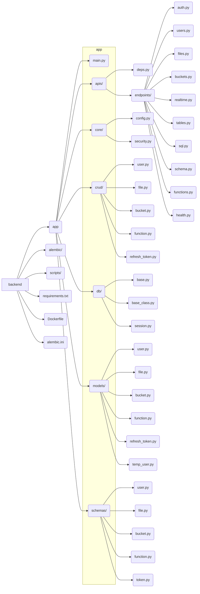

# SelfDB Backend

This project is the backend API for the SelfDB platform, built with FastAPI and Python. It provides the core functionalities for data management, storage, authentication, and real-time features accessed by the SelfDB Admin Dashboard frontend.

## Features

*   **Authentication:** Secure user registration, login (JWT-based), token refresh, and password management.
*   **User Management:** Basic CRUD operations for users.
*   **Table Management:** API endpoints for managing database tables (details likely handled via direct SQL or schema interactions).
*   **SQL Execution:** Endpoint to run arbitrary SQL queries against the database.
*   **Schema Management:** Endpoints to interact with database schemas.
*   **Database Functions:** Management of database functions.
*   **File/Bucket Management:** Integration with the SelfDB Storage Service for object storage, including managing buckets and file uploads/downloads.
*   **Realtime:** WebSocket support for real-time communication.
*   **Database Migrations:** Managed using Alembic.
*   **Health Check:** Endpoint to verify API status.

## Tech Stack

*   **Framework:** FastAPI
*   **Language:** Python 3.13 (from Dockerfile)
*   **Server:** Uvicorn
*   **Database:** PostgreSQL (inferred)
*   **ORM:** SQLAlchemy (async version)
*   **Migrations:** Alembic
*   **Data Validation:** Pydantic
*   **Authentication:** JWT (python-jose), Password Hashing (bcrypt, passlib)
*   **Object Storage:** SelfDB Storage Service
*   **Configuration:** Pydantic Settings, python-dotenv (.env files)
*   **Asynchronous:** Asyncio (via SQLAlchemy, FastAPI)
*   **Realtime:** WebSockets
*   **Rate Limiting:** SlowAPI
*   **Email:** FastAPI-Mail

## Project Structure

The project is organized into several key directories:



### Directory Tree (Simplified)

```
.
├── Dockerfile
├── alembic.ini
├── app
│   ├── apis
│   │   ├── deps.py
│   │   └── endpoints # Routers for different features
│   │       ├── auth.py
│   │       ├── buckets.py
│   │       ├── files.py
│   │       ├── functions.py
│   │       ├── health.py
│   │       ├── realtime.py
│   │       ├── schema.py
│   │       ├── sql.py
│   │       ├── tables.py
│   │       └── users.py
│   ├── core         # Core config, security
│   │   ├── config.py
│   │   └── security.py
│   ├── crud         # CRUD operations
│   │   ├── bucket.py
│   │   ├── file.py
│   │   ├── function.py
│   │   ├── refresh_token.py
│   │   └── user.py
│   ├── db           # Database session, base models
│   │   ├── base.py
│   │   ├── base_class.py
│   │   └── session.py
│   ├── initial_data.py # Script for initial data setup
│   ├── main.py      # FastAPI app entry point
│   ├── models       # SQLAlchemy models
│   │   ├── bucket.py
│   │   ├── file.py
│   │   ├── function.py
│   │   ├── refresh_token.py
│   │   ├── temp_user.py
│   │   └── user.py
│   └── schemas      # Pydantic schemas
│       ├── bucket.py
│       ├── file.py
│       ├── function.py
│       ├── token.py
│       └── user.py
├── requirements.txt
└── scripts          # Utility/helper scripts
    ├── init.sh
    └── run_refresh_token_migration.py
```
*(Note: `migrations/` and `alembic/` directories contain database migration scripts)*

## Setup and Running Locally

### Prerequisites

*   Python 3.13+
*   PostgreSQL Server
*   Docker & Docker Compose (Recommended for easier setup)

### Environment Variables

Create a `.env` file in the `backend` root directory based on `.env.example` (if available) or the settings in `app/core/config.py`. Key variables include:

*   `POSTGRES_SERVER`
*   `POSTGRES_USER`
*   `POSTGRES_PASSWORD`
*   `POSTGRES_DB`
*   `DATABASE_URL` (constructed from the above or set directly)
*   `SECRET_KEY` (for JWT)
*   `ACCESS_TOKEN_EXPIRE_MINUTES`
*   `STORAGE_SERVICE_URL` (URL of the storage service)
*   `ANON_KEY` (for anonymous access)
*   `EMAILS_ENABLED` (and related SMTP settings if true)
*   `API_V1_STR` (usually `/api/v1`)

### Running with Docker (Recommended)

1.  Ensure Docker and Docker Compose are installed.
2.  Configure your `.env` file.
3.  You might need a `docker-compose.yml` file (check the project root or related documentation) that defines the backend service, a PostgreSQL service, and the storage service.
4.  Run from the directory containing `docker-compose.yml`:
    ```bash
    docker-compose up -d --build
    ```

### Running Manually

1.  Create and activate a Python virtual environment:
    ```bash
    python -m venv venv
    source venv/bin/activate # Linux/macOS
    # venv\Scripts\activate # Windows
    ```
2.  Install dependencies:
    ```bash
    pip install -r requirements.txt
    ```
3.  Ensure PostgreSQL and the storage service are running and accessible.
4.  Configure your `.env` file.
5.  Run database migrations:
    ```bash
    alembic upgrade head
    ```
6.  Run the FastAPI application using Uvicorn:
    ```bash
    uvicorn app.main:app --reload --host 0.0.0.0 --port 8000
    ```

## Database Migrations (Alembic)

*   **Generate a new migration:**
    ```bash
    alembic revision --autogenerate -m "Your migration message"
    ```
*   **Apply migrations:**
    ```bash
    alembic upgrade head
    ```
*   **Downgrade migrations:**
    ```bash
    alembic downgrade -1 # Downgrade by one revision
    alembic downgrade base # Revert all migrations
    ```

## API Documentation

Once the server is running, interactive API documentation (Swagger UI) is typically available at `http://localhost:8000/docs` and alternative documentation (ReDoc) at `http://localhost:8000/redoc`.

## Deployment

The included `Dockerfile` allows for containerizing the application. The `CMD` instruction runs the application using Uvicorn. Refer to the `Dockerfile` and potentially CI/CD or orchestration configurations (like Kubernetes manifests or Docker Compose for production) for deployment details.