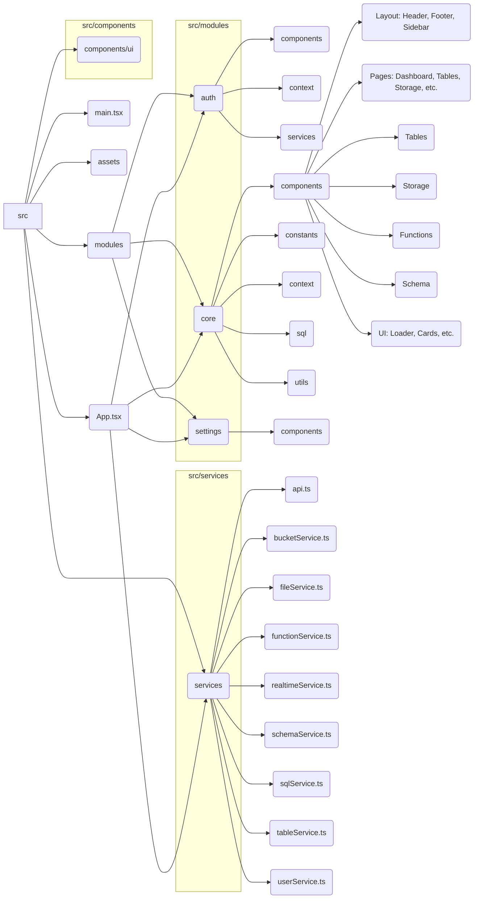

# SelfDB Admin Dashboard Frontend

This project is the frontend for the SelfDB Admin Dashboard, built with React, Vite, and TypeScript. It provides a user interface for managing various aspects of the SelfDB backend, including tables, storage, functions, schemas, and user authentication.

## Features

*   **Authentication:** Login, Registration, Password Management (Forgot/Reset).
*   **Dashboard:** Overview and quick actions.
*   **Table Management:** View table lists, details, structure, data, indexes, relationships, and SQL definitions. Edit table data and structure. Create new tables.
*   **Storage Management:** View storage bucket lists, details, and contents. Upload files. Create new buckets. Manage file permissions and metadata.
*   **SQL Editor:** Execute SQL queries against the database, view results, manage saved snippets, and view query history.
*   **Database Functions:** View function lists and details (including code). Create and manage database functions.
*   **Schema Management:** View database schemas, including table relationships visualized.
*   **Settings:** User profile and password management.
*   **Theme:** Light/Dark mode support.

## Tech Stack

*   **Framework:** React 19
*   **Build Tool:** Vite
*   **Language:** TypeScript
*   **Styling:** Tailwind CSS v3, clsx, tailwind-merge
*   **UI Components:** Radix UI Primitives, shadcn/ui (likely), Lucide Icons, React Icons, Headless UI
*   **Routing:** React Router DOM v7
*   **State Management:** React Context API (AuthContext, ThemeContext)
*   **HTTP Client:** Axios
*   **Code Visualization:** @xyflow/react (for schema diagrams)
*   **File Uploads:** React Dropzone
*   **Linting/Formatting:** ESLint

## Project Structure (`src`)

The project follows a modular structure, primarily organized within the `src/modules` directory.



### Directory Tree (`src`)

```
src
├── App.tsx
├── assets
│   └── react.svg
├── components
│   └── ui
│       ├── avatar.tsx
│       ├── button.tsx
│       ├── confirmation-dialog.tsx
│       ├── dialog.tsx
│       ├── dropdown-menu.tsx
│       ├── input.tsx
│       ├── label.tsx
│       ├── modal.tsx
│       ├── notification.tsx
│       ├── select.tsx
│       ├── table.tsx
│       └── textarea.tsx
├── main.tsx
├── modules
│   ├── auth
│   │   ├── components
│   │   │   ├── LoginForm.tsx
│   │   │   └── LoginPage.tsx
│   │   ├── context
│   │   │   └── AuthContext.tsx
│   │   └── services
│   │       └── authService.ts
│   ├── core
│   │   ├── components
│   │   │   ├── Footer.tsx
│   │   │   ├── Header.tsx
│   │   │   ├── MainLayout.tsx
│   │   │   ├── Sidebar.tsx
│   │   │   ├── TabBar.tsx
│   │   │   ├── activities
│   │   │   │   ├── ActivityItem.tsx
│   │   │   │   └── index.tsx
│   │   │   ├── buttons
│   │   │   │   ├── ActionButton.tsx
│   │   │   │   └── index.tsx
│   │   │   ├── cards
│   │   │   │   ├── Card.tsx
│   │   │   │   ├── SummaryCard.tsx
│   │   │   │   └── index.tsx
│   │   │   ├── functions
│   │   │   │   ├── CodeEditor.tsx
│   │   │   │   ├── FunctionDetail.tsx
│   │   │   │   ├── FunctionForm.tsx
│   │   │   │   ├── FunctionInfoModal.tsx
│   │   │   │   ├── FunctionList.tsx
│   │   │   │   └── index.ts
│   │   │   ├── icons
│   │   │   │   ├── IconProvider.tsx
│   │   │   │   └── index.tsx
│   │   │   ├── pages
│   │   │   │   ├── Auth.tsx
│   │   │   │   ├── Dashboard.tsx
│   │   │   │   ├── Functions.tsx
│   │   │   │   ├── Schemas.tsx
│   │   │   │   ├── SqlEditor.tsx
│   │   │   │   ├── Storage.tsx
│   │   │   │   └── Tables.tsx
│   │   │   ├── schema
│   │   │   │   ├── SchemaVisualization.tsx
│   │   │   │   ├── TableNode.tsx
│   │   │   │   └── index.ts
│   │   │   ├── sections
│   │   │   │   ├── ActionButtonGroup.tsx
│   │   │   │   ├── ActivitySection.tsx
│   │   │   │   ├── SummaryCardGroup.tsx
│   │   │   │   └── index.tsx
│   │   │   ├── storage
│   │   │   │   ├── BucketDetail.tsx
│   │   │   │   ├── BucketForm.tsx
│   │   │   │   ├── BucketFormModal.tsx
│   │   │   │   ├── BucketInfoDisplay.tsx
│   │   │   │   ├── BucketList.tsx
│   │   │   │   ├── FileList.tsx
│   │   │   │   ├── FileUploader.tsx
│   │   │   │   └── index.ts
│   │   │   ├── tables
│   │   │   │   ├── TableCreate.tsx
│   │   │   │   ├── TableData.tsx
│   │   │   │   ├── TableDetail.tsx
│   │   │   │   ├── TableEdit.tsx
│   │   │   │   ├── TableIndexes.tsx
│   │   │   │   ├── TableInfoModal.tsx
│   │   │   │   ├── TableList.tsx
│   │   │   │   ├── TableRelationships.tsx
│   │   │   │   ├── TableSql.tsx
│   │   │   │   └── TableStructure.tsx
│   │   │   └── ui
│   │   │       └── Loader.tsx
│   │   ├── constants
│   │   │   └── databaseTypes.ts
│   │   ├── context
│   │   │   └── ThemeContext.tsx
│   │   ├── sql
│   │   │   ├── components
│   │   │   │   ├── SaveSnippetDialog.tsx
│   │   │   │   ├── SqlCodeEditor.tsx
│   │   │   │   ├── SqlHistoryList.tsx
│   │   │   │   ├── SqlResultsTable.tsx
│   │   │   │   └── SqlSnippetsList.tsx
│   │   │   └── index.ts
│   │   └── utils
│   │       ├── cn.ts
│   │       ├── formatters.ts
│   │       └── sqlFormatter.ts
│   └── settings
│       └── components
│           ├── PasswordChangeModal.tsx
│           └── Settings.tsx
├── pages
└── services
    ├── api.ts
    ├── bucketService.ts
    ├── fileService.ts
    ├── functionService.ts
    ├── realtimeService.ts
    ├── schemaService.ts
    ├── sqlService.ts
    ├── tableService.ts
    └── userService.ts

30 directories, 95 files
```

## Setup and Running Locally - Frondend alone

1.  **Prerequisites:** Node.js (check `.nvmrc` or `package.json` engines if specified), npm/yarn/pnpm.
2.  **Clone the repository:** (If not already done)
    ```bash
    git clone <repository-url>
    cd SelfDB/frontend
    ```
3.  **Install dependencies:**
    ```bash
    npm install
    # or yarn install or pnpm install
    ```
4.  **Environment Variables:** Create a `.env` file in the `frontend` root directory. Add necessary environment variables, likely including the backend API URL. Example:
    ```env
    VITE_API_BASE_URL=http://localhost:8000/api/v1
    # Add other variables as needed (e.g., for authentication keys if handled client-side)
    ```
    *(Note: Check `src/services/api.ts` or similar for the exact variable name used)*
5.  **Run the development server:**
    ```bash
    npm run dev
    ```
    The application should be available at `http://localhost:3000` (or the port specified in `vite.config.ts`).

## Available Scripts

*   `npm run dev`: Starts the Vite development server.
*   `npm run build`: Builds the application for production.
*   `npm run lint`: Lints the codebase using ESLint.
*   `npm run preview`: Serves the production build locally.

## Deployment

This project includes a `Dockerfile` and `nginx.conf`, suggesting it's intended for containerized deployment using Docker and Nginx as a web server/reverse proxy.

To build the Docker image:

```bash
docker build -t selfdb-frontend .
```

Refer to the `Dockerfile` and potentially deployment scripts or CI/CD configuration for specific deployment instructions.
