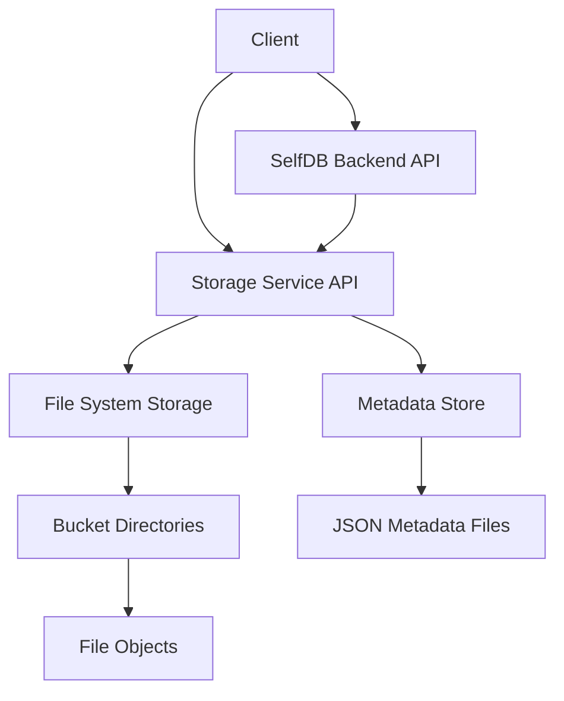

# SelfDB Storage Service

This is a FastAPI-based file storage microservice for SelfDB, designed to provide object storage capabilities while being lightweight and directly integrated with the SelfDB ecosystem. It serves as a replacement for MinIO, offering simplified architecture and reduced resource usage.

## Features

- **Bucket Management**: Create, list, update, and delete storage buckets
- **File Operations**: Upload, download, list, and delete files
- **Access Control**: Public/private bucket permissions with fine-grained access control
- **Authentication**: JWT-based authentication shared with the main SelfDB backend
- **Anonymous Access**: Support for anonymous access to public buckets via API key
- **Direct File Access**: Permanent URLs for file access
- **Metadata Management**: Store and retrieve custom metadata for files
- **Content Type Detection**: Automatic detection of file MIME types
- **Efficient Storage**: Optimized for both small and large files
- **Scalability**: Designed to handle high volumes of files and concurrent access
- **High Performance**: Optimized for concurrent uploads and downloads with efficient resource usage

## Why Replace MinIO?

The storage service was developed to replace MinIO for several reasons:

1. **Simplified Architecture**: Eliminates the need for a separate S3-compatible service
2. **Reduced Resource Usage**: Significantly lower memory and CPU requirements
3. **Tighter Integration**: Direct integration with SelfDB authentication and permission systems
4. **Easier Configuration**: Fewer configuration parameters and simpler setup
5. **Consistent API**: API design that matches the rest of the SelfDB ecosystem
6. **Optimized for SelfDB Use Cases**: Tailored specifically for SelfDB application needs

## Architecture

The storage service uses a filesystem-based storage backend with several optimizations:

- Each bucket is a directory in the storage volume
- Files are stored directly in their respective bucket directories
- Metadata is stored in JSON files alongside the actual file data
- File permissions are enforced through the API layer
- Non-blocking I/O operations for high concurrency



### Core Components

- **FastAPI Application**: The main application serving API endpoints
- **Bucket Router**: Handles bucket management operations
- **Files Router**: Manages file uploads, downloads, and metadata operations
- **Storage Core**: Provides optimized file system operations
- **Security Module**: Handles authentication and authorization
- **Configuration**: Environment-based configuration management

## Project Structure

```
storage_service/
├── app/
│   ├── apis/
│   │   ├── endpoints/
│   │   │   ├── buckets.py    # Bucket management endpoints
│   │   │   ├── files.py      # File operations endpoints
│   │   │   └── __init__.py
│   │   └── __init__.py
│   ├── core/
│   │   ├── config.py         # Application settings
│   │   ├── security.py       # Authentication and authorization
│   │   ├── storage.py        # Base storage operations
│   │   ├── optimized_storage.py # Performance-optimized storage operations
│   │   └── __init__.py
│   ├── routers/
│   │   └── __init__.py
│   ├── schemas/
│   │   └── __init__.py
│   ├── main.py               # FastAPI application entry point
│   └── __init__.py
├── tests/                    # Test suite
├── Dockerfile                # Container definition
├── requirements.txt          # Python dependencies
├── README.md                 # This documentation
└── run_tests.sh              # Script to run the test suite
```

## API Endpoints

### Bucket Operations

- `POST /buckets` - Create a new bucket
- `GET /buckets` - List all accessible buckets
- `GET /buckets/{bucket_id}` - Get bucket details
- `PUT /buckets/{bucket_id}` - Update bucket properties
- `DELETE /buckets/{bucket_id}` - Delete a bucket

### File Operations

- `POST /files/upload/{bucket_id}` - Upload a file to a bucket
- `POST /files/initiate-upload` - Initiate a multi-step upload (get presigned URL)
- `GET /files/list/{bucket_id}` - List files in a bucket
- `GET /files/download/{bucket_id}/{file_id}` - Download a file
- `GET /files/info/{bucket_id}/{file_id}` - Get file metadata
- `PUT /files/metadata/{bucket_id}/{file_id}` - Update file metadata
- `DELETE /files/{bucket_id}/{file_id}` - Delete a file

## Performance Optimizations

The storage service includes several optimizations for high-performance file operations:

1. **Asynchronous I/O**: Non-blocking file operations using `aiofiles`
2. **Chunked Processing**: Large files are processed in manageable chunks
3. **Streaming Responses**: Files are streamed directly to clients without loading entirely into memory
4. **Concurrent Request Handling**: Efficient handling of multiple concurrent uploads/downloads
5. **Optimized Metadata Storage**: Fast access to file metadata
6. **Memory Efficiency**: Careful management of memory usage during file operations

## Tech Stack

- **Framework**: FastAPI
- **ASGI Server**: Uvicorn
- **Python Version**: 3.11
- **Authentication**: JWT (python-jose)
- **File Handling**: aiofiles, python-multipart
- **Configuration**: pydantic-settings, python-dotenv
- **Containerization**: Docker

## Configuration

The storage service is configured through environment variables:

| Variable | Description | Default |
|----------|-------------|---------|
| `STORAGE_PATH` | Root directory for file storage | `/data/storage` |
| `SECRET_KEY` | Secret key for JWT validation (must match backend) | (required) |
| `ALGORITHM` | Algorithm used for JWT | `HS256` |
| `BASE_URL` | Base URL for constructing file URLs | `http://localhost` |
| `STORAGE_SERVICE_PUBLIC_URL` | Public URL for storage service | `http://localhost:8001` |
| `ANON_KEY` | API key for anonymous access (must match backend) | `None` |

## Development

### Prerequisites

- Python 3.11+
- FastAPI
- Docker and Docker Compose (for containerized deployment)

### Running Locally

1. Install dependencies:
   ```bash
   pip install -r requirements.txt
   ```

2. Set up environment variables:
   ```bash
   export STORAGE_PATH=./data
   export SECRET_KEY=your_secret_key
   export ANON_KEY=your_anonymous_key
   ```

3. Run the service:
   ```bash
   uvicorn app.main:app --host 0.0.0.0 --port 8001 --reload
   ```

4. Access the API documentation:
   ```
   http://localhost:8001/docs
   ```

### Testing

Run the test script to verify functionality:

```bash
./run_tests.sh
```

This will execute all tests in the `tests/` directory and provide a coverage report.

## Docker Deployment

The storage service is designed to run as part of the SelfDB Docker Compose setup:

```yaml
# Example docker-compose.yml snippet
services:
  storage_service:
    build: ./storage_service
    volumes:
      - storage_data:/data/storage
    environment:
      - STORAGE_PATH=/data/storage
      - SECRET_KEY=${SECRET_KEY}
      - ANON_KEY=${ANON_KEY}
      - STORAGE_SERVICE_PUBLIC_URL=http://localhost:8001
    ports:
      - "8001:8001"
    networks:
      - selfdb-network
    restart: unless-stopped

volumes:
  storage_data:
```

## Integration with SelfDB Backend

The storage service is integrated with the main SelfDB backend through:

1. **Shared Authentication**: Uses the same JWT tokens and anonymous API key
2. **HTTP Client**: Backend communicates with storage service via HTTP client
3. **Unified API Gateway**: Nginx reverse proxy provides unified API access
4. **Consistent Permissions**: Permissions model aligns with SelfDB's user system
5. **Shared Environment**: Configuration through shared environment variables

### Backend Integration Examples

The backend integrates with the storage service using dedicated endpoints:

1. **File Uploads**:
   - Backend creates file metadata record
   - Backend requests presigned upload URL from storage service
   - Client uploads directly to storage service using the presigned URL
   - WebSocket notification informs clients of upload completion

2. **File Downloads**:
   - Backend verifies user permissions
   - Backend requests download URL from storage service
   - User downloads directly from storage service

## Scaling and Production Considerations

For production deployments with high traffic, consider the following:

1. **File Size Limits**: Set appropriate maximum file size limits in both Nginx and the storage service
2. **Storage Volume**: Use high-performance storage volumes for the file system
3. **Concurrency Settings**: Tune Uvicorn worker count and concurrency settings
4. **Memory Allocation**: Provide sufficient memory for handling concurrent uploads/downloads
5. **Monitoring**: Implement monitoring for storage usage, request rates, and error rates
6. **Backup Strategy**: Regular backups of the storage volume
7. **CDN Integration**: For frequently accessed public files, consider CDN integration

## Troubleshooting

Common issues and their solutions:

1. **Permission Errors**: Ensure the storage directory has appropriate permissions for the container user
2. **JWT Validation Errors**: Verify that the `SECRET_KEY` matches the one used by the backend
3. **Upload Size Limits**: Check Nginx and FastAPI request size limits if large uploads fail
4. **Performance Issues**: Monitor CPU, memory, and disk I/O during high load periods

## Contributing

Contributions to the storage service are welcome. Please follow these steps:

1. Fork the repository
2. Create a feature branch
3. Make your changes with appropriate tests
4. Submit a pull request

Please ensure your code passes all tests and follows the project's coding style.
